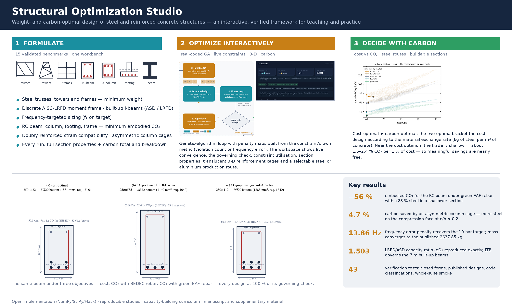

# Structural Optimization Studio

**Weight- and carbon-optimal design of steel and reinforced concrete structures — an interactive, verified framework for teaching and practice.**



*Graphical abstract.* Fifteen validated benchmarks are formulated once, optimized with a transparent real-coded genetic algorithm in a live web workspace, and read through the lens of embodied carbon: every run reports its governing limit state, its full section properties, and a carbon total with breakdown, and the cost-optimal and carbon-optimal designs are shown as buildable sections side by side.

## What it is

Structural Optimization Studio is an open Python/JavaScript application that unifies the classic **minimum-weight steel benchmarks** (planar and space trusses, moment and braced frames, a discrete AISC-LRFD moment frame, frequency-targeted sizing, and AISC 360 built-up I-beams under ASD and LRFD) with **minimum-embodied-carbon reinforced-concrete design** (beam, column, spread footing and a three-storey frame) in one workbench. The analysis engine — direct-stiffness finite elements, consistent-mass modal analysis, strain-compatibility RC section mechanics and the AISC F2–F5 / G2 member checks — and the optimizer are written from first principles in NumPy/SciPy with no external structural or optimization packages, so every number can be traced, tested and taught.

It is built first as a **capacity-building tool**: students watch a constrained search unfold, read which check governs, perturb one decision (a bound, a bracing condition, a steel production route) and see the optimum move; practitioners enter through code-checked problems they recognise and leave with a quantified view of what procurement decisions do to embodied carbon.

## Highlights

- **15 benchmarks, one interface** — trusses, frames, a discrete W-shape moment frame, frequency-targeted sizing, RC members and frames, built-up I-beams (ASD / LRFD).
- **Complete RC flexural search spaces** — both section dimensions and both steel layers as variables; doubly-reinforced strain compatibility with the ACI φ transition; asymmetric column cages where the moment sense is fixed; strong-column/weak-beam in the frame; ACI 318-19 effective inertia for deflection.
- **Full AISC 360 classification** — compact, noncompact and slender flanges *and* webs (F2–F5), lateral-torsional buckling for any unbraced length with an explicit C_b, G2 shear, L/360 serviceability, F13 proportioning; identical mechanics under ASD (Ω = 1.67) and LRFD (φ = 0.90).
- **Carbon in every experiment** — steel and aluminium problems report embodied carbon by member role at a selectable production route; RC problems optimize it directly with BEDEC unit factors and five source-cited rebar routes (2.82 → 0.36 kg CO₂/kg).
- **Constraint handling built from the engineering target** — frequency-constrained problems rank infeasible designs by their frequency error, which recovered a benchmark previously misreported as unattainable.
- **Verified** — 43 pytest checks pin closed-form anchors, published designs, code-classification behaviour and a whole-suite smoke run.
- **Reproducible** — every figure and table in the documentation and manuscript regenerates from `studies/` with fixed seeds.
- **Workspace** — light and dark themes; a selectable metal (benchmark, aluminium, steel) for the truss and frame problems; an embodied-carbon card with per-material breakdown and an indicative cost estimate at the top of every result; amplitude-scaled utilisation bars with a shared legend; and a cost versus CO₂ scatter of all evaluated designs for the RC problems.

## The benchmark library

| # | Problem | Family | Variables | Objective | Governing checks | Reference |
|---|---|---|---|---|---|---|
| 1–3 | 10-, 25-, 72-bar trusses | steel / aluminium weight | 10–16 areas | mass | stress, displacement, AISC compression (25-bar) | 2299.7 / 649.7 / 172.2 kg |
| 4–5 | 10-, 25-member frames | steel weight | 10–25 areas | mass | combined stress, drift | 3307.2 / 9508.3 kg |
| 6 | 3-storey steel MRF (Pezeshk et al.) | steel weight, discrete | 2 W-shapes | weight | AISC-LRFD H1, B1/B2, sway K | 18,792 lb |
| 7–9 | 10-bar, 72-bar, portal frame | frequency target | 6–16 areas | mass s.t. f₁ | frequency band | 2637.9 / 287.1 / 4272.3 kg |
| 10 | RC beam | embodied CO₂ | b, h, As,bot, As,top | CO₂ | flexure, shear, ductility, deflection | 727.8 kg |
| 11 | RC column | embodied CO₂ | b, h, As per face | CO₂ | P–M interaction, ρ limits, slenderness | 163.0 kg |
| 12 | RC spread footing | embodied CO₂ | B, L, h, two mats | CO₂ | bearing, punching, one-way shear, flexure | 1155.8 kg |
| 13 | RC 3-storey frame | embodied CO₂ | 7 | CO₂ | ACI flexure/shear, P–M, SCWB 18.7.3.2 | 5301.9 kg |
| 14–15 | Built-up I-beam, ASD / LRFD | steel weight, code-based | b_f, t_f, h_w, t_w | mass | AISC F2–F5, G2, L/360, F13 | 312.7 / 276.7 kg |

References are published optima for the classic steel problems and multi-seed studio calibrations elsewhere; documented divergences (the 25-bar, 25-member and 72-bar cases; the MRF's 0.3 % interaction margin) are explained in the workspace and in `studies/`.

## Quick start

```bash
pip install -r requirements.txt        # runtime only
python app.py                          # open http://127.0.0.1:5000
pip install -r requirements-dev.txt    # tests, studies, documentation
python -m pytest -q tests              # 46 verification tests, ~11 s
```

Pick a benchmark card, set the population and generations, optionally edit the design inputs (moment, span, F_y, bracing, C_b) or the material production route, and press **Optimize**. The workspace streams convergence live, then shows the governing check, constraint utilisation, section properties, a 3-D model with translucent concrete and reinforcement cages, the embodied-carbon breakdown and a JSON export.

## Repository layout

| Path | Contents |
|---|---|
| `engine.py` | problem library, analysis engine, genetic algorithm, carbon accounting, AISC and RC section mechanics |
| `app.py`, `templates/`, `static/` | Flask API and the interactive workspace (three.js) |
| `thumbs.py` | SVG thumbnails for the benchmark cards |
| `tests/` | pytest verification suite |
| `studies/` | reproducibility scripts: figures, PDF documentation, cost-vs-carbon studies, validation set, manuscript pipeline, flowchart |
| `docs/` | graphical abstract, capacity-building curriculum, manuscript base document |

## Verification and reproducibility

The test suite pins the mechanics rather than the outputs: the doubly-reinforced solver reproduces the closed-form singly-reinforced strength to machine precision where that form is valid; two independent column solvers agree at pure bending; the AISC module returns exactly M_p for a compact, laterally supported section, is monotone in L_b, and gives an LRFD/ASD capacity ratio of φΩ = 1.503 to 10⁻⁶; the published W24×62/W10×60 moment-frame design evaluates feasible at 93.6 % beam utilisation; and every registered problem evaluates, optimizes and reports carbon. `studies/README.md` lists the scripts that regenerate every figure and table, including the route study, the Pareto fronts, the regime map, the multi-seed statistics and the whole-frame closure.

## Teaching with it

`docs/CAPACITY_BUILDING.md` is a six-module pathway — sizing under stress, frames and drift, code-checked steel, frequency targets, RC and carbon, carbon as a decision — each with learning outcomes, a seeded exercise and the expected numerical outcome so learners can check themselves.

## Deploying on a website

The app is a Flask service; the simplest route is a one-click host plus an iframe:

1. Upload the folder to a GitHub repository.
2. On [Render](https://render.com) choose **New → Blueprint** and connect the repository; `render.yaml` and `Procfile` configure the build (keep `--workers 1`: running jobs live in memory).
3. Embed the resulting URL on your site — for Wix, **Add → Embed Code → Embed HTML** and paste `<iframe src="https://YOUR-APP.onrender.com" width="100%" height="950" style="border:0"></iframe>`. `EMBED_ALLOW` restricts which sites may frame the app.

See `DEPLOY_TO_WIX.md` for the step-by-step version.

## Modelling conventions worth knowing

- Frame analysis is first-order elastic (with LRFD B1/B2 amplification where the benchmark requires it); the RC frame uses ACI cracked stiffnesses and one lateral pattern.
- Column interaction uses φ = 0.65 uniformly (conservative), applied identically to every objective.
- The built-up beam module treats unstiffened doubly symmetric sections; C_b defaults to 1.0 and is user-editable.
- Emission factors are indicative snapshots (BEDEC, worldsteel, IEEFA, Columbia CBS, New Steel Construction, IAI, ICE); aluminium factors apply to the classic aluminium trusses.

## Citation

If you use the studio, please cite the accompanying manuscript: *Interactive Genetic-Algorithm Optimization of Steel and Reinforced Concrete Structures for Minimum Weight and Embodied Carbon* (2026). Created by Ahmed A. Torky (https://www.linkedin.com/in/ahmed-a-torky/); the website is experimental.

## License

Released under the MIT License — see `LICENSE`.
